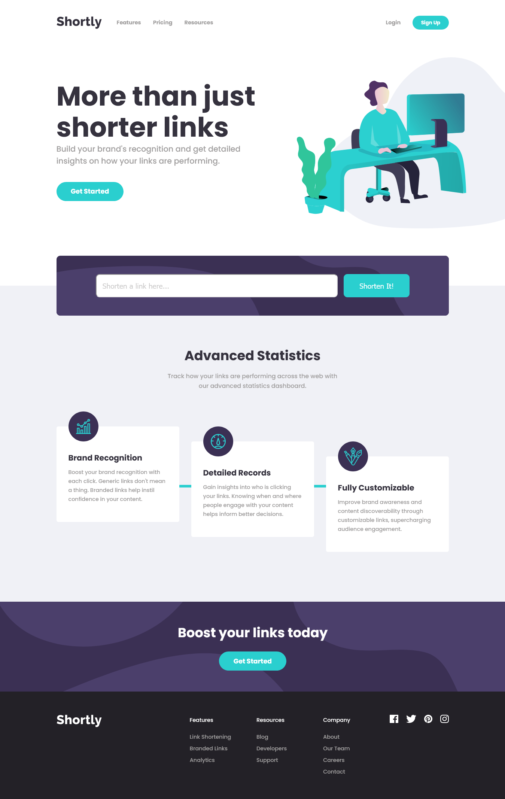

# Shortly - Live Site URL: [https://shortly-shortlink.netlify.app/](https://shortly-shortlink.netlify.app/)
  - REACTJs URL Shortener landing page using an API from https://shrtco.de/ and is a revision of the previous project of the same kind using HTML,CSS, and Javascript. This react app was built using codesandbox.io 
  
## Table of contents

- [Overview](#overview)
  - [Screenshot](#screenshot)
  - [Links](#links)
- [Codesandbox React App](#codesandbox-react-app)
- [Publishing to Github](#publish-to-github)
- [Untracked Files - Can't Commit to Repo](#untracked-files)

## Overview

### Screenshot



### Links

- Live Site URL: [https://shortly-shortlink.netlify.app/](https://shortly-shortlink.netlify.app/)

## Codesandbox React App

1. Create a new sandbox:
2. Rename the title with an appropriate name.
3. Under **.src folder**, create an `assets` folder and `components` folder.
4. In the `assets` folder, upload all the images from your local machine.
5. In the `components` folder, create the following folders and the corresponding js and css files inside them:
     > - header
     >   - Header.js
     >   - HeaderStyles.css
     > - hero
     >   - Hero.js
     >   - HeroStyles.css
     > - advanced
     >   - Advanced.js
     >   - AdvancedStyles.css
     > - shortener
     >   - Shortener.js
     >   - ShortenerStyles.css
     > - links
     >   - Links.js
     >   - LinksStyles.css
     > - boost
     >   - Boost.js
     >   - BoostStyles.css
     > - footer
     >   - Footer.js
     >   - FooterStyles.css

6. Install the following dependencies: 
     - react-icons
     - react-scroll
     - react-router-dom
7. Setting up the **Hamburger menu** for the `<Navbar />` when screen is less than 940px:
     > import `{useState}` from 'react'
     ```js
          import React, {useState} from 'react'
          import {SiDatabricks} from 'react-icons/si'
          import {FaBars} from 'react-icons/fa'
          import {FaTimes} from 'react-icons/fa'
          import './NavbarStyles.css'

          const Navbar = () => {
          const [nav,setNav] = useState(false)
          const handleNav = () => setNav(!nav)

          return (
          <div name='top' className='navbar'>
               <div className='container'>
                    <div className="logo">
                         <SiDatabricks className='icon' />
                         <h1>Secured.</h1>
                    </div>
                    <ul className={nav ? 'nav-menu active' : 'nav-menu'}>
                         <li>Home</li>
                         <li>Recovery</li>
                         <li>Cloud</li>
                         <li>Contact</li>
                         <button>Sign in</button>
                    </ul>
                    <div className="hamburger" onClick={handleNav}>
                         {!nav ? (<FaBars className="icon" />):(<FaTimes className="icon" />)}
                    </div>
               </div>
          </div>
          )
          }

          export default Navbar
     ```

     ```css
          .hamburger {
          display: none;
          padding: 1rem;
          }

          @media screen and (max-width: 940px) {
          .navbar .hamburger {
               display: block;
               z-index: 15;
          }
          .navbar .nav-menu {
               position: absolute;
               flex-direction: column;
               width: 100%;
               height: 100vh;
               top: 0;
               left: -100%;
               align-items: center;
               justify-content: center;
               background: rgba(0, 0, 0, 0.8);
               transition: 0.5s ease-in;
          }
          .navbar .active {
               left: 0;
          }
          .navbar li {
               margin-right: 1rem;
               font-size: 2rem;
          }
          .navbar button {
               font-size: 1.8rem;
          }
          }
     ```    
---

## Publishing to Github:

1. Create a local git repository:
     `git init`
2. If there are uncommited files in the source control:
     `git commit -m "Your comment"`
3. Go to Github account and create a new Repo
4. Copy the link of the repo.
5. Type in the terminal in succession
     > Map the remote repo link to local git repo:
     > `git remote add origin <link>`
     >
     > Verifies the link to the remote repo:
     > `git remote -v`
     >
     > Pushes to commited changes into the remote repo:
     > `git push -u origin master`

IF ERROR:
     > error: src refspec master does not match any.  
     > error: failed to push some refs to 'ssh://xxxxx.com/project.git'

The most probable reason for this error is that all the files are untracked and have not been added. `git add --all` in case you wish to add all the files Or you can selectively add files. Then git `commit -m "Initial comment"`, `git push origin master`. This will surely work.

---

## Untracked Files and can't commit to repository:

  > PS C:\Users\lenovo\Documents\webdev1_Jul\REACT\shorten-api> `git branch --set-upstream-to=origin/main main`
  >
  > fatal: branch 'main' does not exist
  >
  > PS C:\Users\lenovo\Documents\webdev1_Jul\REACT\shorten-api> `git pull origin master`
  >
  >  * branch            master     -> FETCH_HEAD
  >
  > Already up to date.
  >
  > PS C:\Users\lenovo\Documents\webdev1_Jul\REACT\shorten-api> `git remote -v`
  >
  > origin  https://github.com/julfinch/shorten-api.git (fetch)
  >
  > origin  https://github.com/julfinch/shorten-api.git (push)
  >
  > PS C:\Users\lenovo\Documents\webdev1_Jul\REACT\shorten-api> `git push`
  >
  > fatal: The current branch master has no upstream branch.
  > To push the current branch and set the remote as upstream, use
  > 
  >     git push --set-upstream origin master
  > 
  > PS C:\Users\lenovo\Documents\webdev1_Jul\REACT\shorten-api> `git push --set-upstream origin master`  
  >
  > Enumerating objects: 237, done.
  > Counting objects: 100% (237/237), done.
  > Delta compression using up to 2 threads
  > Compressing objects: 100% (226/226), done.
  > Writing objects: 100% (227/227), 23.16 MiB | 78.00 KiB/s, done.
  > Total 227 (delta 9), reused 0 (delta 0), pack-reused 0
  > remote: Resolving deltas: 100% (9/9), completed with 5 local objects.
  >
  > To https://github.com/julfinch/shorten-api.git
  >
  >    0bc4464..f5e9c93  master -> master
  >
  > Branch 'master' set up to track remote branch 'master' from 'origin'.
  >
  > PS C:\Users\lenovo\Documents\webdev1_Jul\REACT\shorten-api> 

---

### Built with

- Semantic HTML5 markup
- CSS custom properties
- ReactJS
- Vite

---
 
## Author

- Twitter - [@julfinch](https://www.twitter.com/julfinch)
